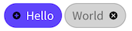

# Maui.Chips
*Chip support for Maui*

## Credit
This library / nuget package is based off a great Xamarin Version that can be found here:

https://github.com/Tommigun1980/Xamarin.Forms.Chips

This was created to provide some of the same functionality to Maui.




NuGet package available at https://www.nuget.org/packages/Maui.Chips/

## Usage

Import the Chips assembly:
```xaml
xmlns:chips="clr-namespace:Maui.Chips;assembly=Maui.Chips"
```

And place it in your view:
```xaml
<chips:Chip
    Text="Hello"
    Padding="8, 5"
    OnClicked="Chip_Clicked" />
```


See [Chip.xaml.cs](Maui.Chips/Chip.xaml.cs) for all bindable properties.
